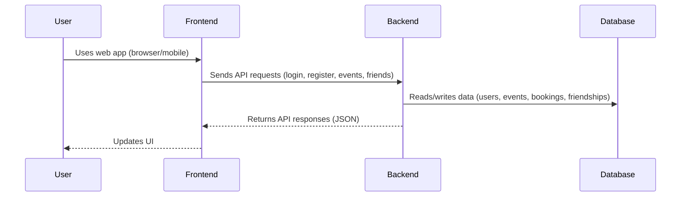

# Architecture
## 1. Introduction and Goals
Our event planning app aims to provide an intuitive platform for both private and public events.
Created events should be bookable for individual users. Additionally, users can create and join
friend groups. When a large event, such as the Greenfield Festival, is approaching, users can
plan the event within these friend groups.

Many event planning tools lack seamless coordination between individual and group event
management. Users often struggle with disorganized planning, scattered communication, and
difficulty in keeping track of event details. Our app addresses these challenges by offering:
### 1.1 Quality Goals
| Goal                             | Description                                                                                       |
|----------------------------------|---------------------------------------------------------------------------------------------------|
| **Centralized event management** | Provides a unified platform to manage both private and public events efficiently.                 |
| **Seamless group coordination**  | Allows users to create and join friend groups for better event planning and participation.        |
| **Integrated booking system**    | Ensures easy access to events by providing a built-in booking and reservation feature.            |
| **Comprehensive event details**  | Displays key event information, including date, location (with map), required items, and pricing. |
| **Calendar synchronization**     | Enables integration with external calendars like Google Calendar for better scheduling.           |
### 1.2 Stakeholder
| Who?                             | Expectation?                                                                             |
|----------------------------------|------------------------------------------------------------------------------------------|
| **Individual Users**             | Need an intuitive interface for event discovery, booking, and participation.             |
| **Event Organizers**             | Require efficient tools for event creation, attendee management, and logistics planning. |
| **Friend Groups**                | Benefit from collaborative planning features for shared events.                          |
| **Business& Public Event Hosts** | Need visibility to attract attendees and manage large-scale event logistics.             |                

## 2. Constraints

### 2.1 Technical Constraints
- **Frontend** is implemented using **JavaScript with React**, built and bundled via **Vite**.
- **Backend** is developed using **.NET**.
- The application must run in modern **browsers** and support a **mobile-first** responsive design.
- **PostgreSQL** is used as the relational database system.
- **Docker** is used for containerization across environments.
- **Helm Charts** are used for Kubernetes deployment configuration.
- The application is deployed using **Argo CD** (GitOps) and **GitHub Actions**.
- The static frontend build is also deployed via **GitHub Pages** when needed.

### 2.2 Organizational Constraints
- The project is developed collaboratively by a **team of 9 people**.
- Source code and collaboration are managed through **GitHub**.
- Continuous Integration and Delivery (CI/CD) is enforced via **GitHub Actions** workflows.
- Contributions follow a branching strategy and pull request process defined by the team.

### 2.4 Standards and Guidelines
- Frontend UI must comply with **mobile-first design principles**.
- Backend APIs should follow RESTful principles with JSON as the data format.
- Code quality is enforced using linters and formatters (e.g., ESLint, Prettier for frontend; .NET analyzers for backend).
- Infrastructure must be fully **declarative**, version-controlled, and reproducible via Helm and Argo CD.

### 2.5 Tooling Constraints
- **Vite** is required for frontend development and hot module replacement.
- **.NET SDK** is required for backend development and API generation.
- **Docker**, **Kubernetes**, **Helm**, and **Argo CD** form the deployment toolchain.
- Project management and issue tracking are conducted through **GitHub Projects** and Issues.

## 3. Context and Scope
### System Boundaries
The Plananaz app consists of three main subsystems:

**Frontend**: React-based web application (served via Vite, deployed with Docker/GitHub Pages).
**Backend**: .NET Web API (handles business logic, authentication, and data access).
**Database**: PostgreSQL (stores users, events, friendships, bookings).

**Out of scope**: External calendar providers (e.g., Google Calendar), third-party authentication providers, and external event listing services.

### Interaction Diagram


### Contextual Overview
The system is a centralized event management platform for private and public events. Users interact with the frontend via browsers or mobile devices. The frontend communicates with the backend using RESTful APIs. The backend manages business logic, authentication, and data persistence, interfacing with a PostgreSQL database. 

## 4. Solution Strategy
The solution is designed to maximize modularity, scalability, and maintainability while leveraging modern development and deployment practices. The main strategies are:

- **Separation of Concerns:**  
  The system is split into frontend, backend, and database subsystems. Each is developed and deployed independently, allowing for clear responsibility boundaries and easier maintenance.

- **Modern Technology Stack:**  
  - **Frontend:** Built with React and Vite for fast development and a responsive, mobile-first user experience.
  - **Backend:** Implemented in .NET Web API, following RESTful principles and using JWT for stateless authentication.
  - **Database:** PostgreSQL is used for reliable relational data storage.

- **API-First Communication:**  
  All interactions between frontend and backend use RESTful APIs with JSON, ensuring loose coupling and enabling future integration with other clients or services.

- **Security by Design:**  
  Authentication and authorization are handled using JWT tokens. Passwords are securely hashed with BCrypt. Sensitive operations are protected by ASP.NET Core’s `[Authorize]` attribute.

- **DevOps and Automation:**  
  - **CI/CD:** Automated testing, building, and deployment using GitHub Actions.
  - **Containerization:** Docker is used for consistent environments across development, testing, and production.
  - **Kubernetes & GitOps:** Helm charts and Argo CD manage deployments, ensuring reproducibility and easy rollbacks.

- **Collaboration and Quality:**  
  Code quality is enforced via linters, formatters, and code reviews. The team follows a defined branching and pull request strategy to ensure high-quality contributions.

## 5. Building Block View
### Component: `UserController`
Responsible for handling all user-related HTTP API endpoints, including:

- User registration (`POST /api/users/register`)
- User login (`POST /api/users/login`)
- Validating JWT tokens (`POST /api/users/validate`)
- User and friends management (protected routes)

### Component: `IAuthService`
Encapsulates authentication logic, such as:

- Registering new users
- Verifying credentials
- Generating JSON Web Tokens (JWT)

### Component: `EfDbContext`
Entity Framework Core database context for persisting and querying users and friendships.

### Component: `AuthService`
Concrete implementation of `IAuthService`, responsible for:

- Password hashing and verification using BCrypt 
- Creating new users in the database 
- Generating signed JWT tokens with claims (UserId, Email)
- Validating user credentials

### Component: `FriendController`

Handles friendship APIs:
- Send friend request: `POST /api/friends/request`
- Accept/reject request: `POST /api/friends/respond`
- List friend requests: `GET /api/friends/requests`
- List friends: `GET /api/friends/list`

### Component: `IFriendService`

- Interface for friend request logic
- Abstracts business rules

### Component: `FriendService`

- Concrete logic:
  - Send, accept, reject friend requests
  - Manage friendships
- Validates uniqueness/self-requests
- Interacts with `EfDbContext`


## 6. Runtime View
### Scenario: User Registration

```text
1. Client sends a POST request to /api/users/register with email, password, username, and optional profile picture.
2. UserController validates the request and calls AuthService.RegisterAsync.
3. AuthService checks for duplicate email and username.
4. Password is hashed with BCrypt.
5. New user is stored in the database.
6. JWT token is generated with claims and 1-hour expiration.
7. Token is returned to the client.
```

#### Scenario: User Login
```text
1. Client sends a POST request to /api/users/login with email and password.
2. UserController calls AuthService.LoginAsync.
3. AuthService verifies password against stored hash.
4. On success, JWT token is generated.
5. Token is returned to the client.

```
#### Scenario: Sending a Friend Request
```text
1. Client sends POST to /api/friends/request with ReceiverId
2. FriendController validates, checks for duplicates
3. FriendService creates a FriendRequest with status Pending
4. Saved via EfDbContext
5. 200 OK returned

```
#### Scenario: Accepting a Friend Request
```text
1. Client sends POST to /api/friends/respond with RequestId and Accept = true
2. Controller validates ownership
3. FriendService sets request to Accepted and creates Friendship
4. Saved via EfDbContext
5. 200 OK returned
```
## 7. Deployment View
As this is the scope of a school project we were limited to the available hardware environemnt our school provided. Therefore we choose to use rancher paired with argoCD to host our enivronment. Our building pipline uses Github Actions. In the following sectino a typical CI-CD pipeline run is described. It triggers when something is pushed into the dev branch on the fullstack repository.

### GitHub Actions
1. We use two different building pipelines for frontend and backend. They get triggered when there are changes in the folder backend or frontend in the dev branch. The action runs all the test.
2. If all tests pass a Docker image gets built and pushed to the GHCR of the organization. It is tagged with the current commit hash. 
3. At last the workflow updates the operation repository, using a dipsatch event. It changes the image tag to the newly built one.

### Argo CD
4. ArgoCD watches the dev and main branch for changes. It realizes, that there were changes in the operations repository. It pulls the updated manifest and compares it to the current one.
5. If there are changes detected. ArgoCD tells rancher what ressources to update.
7. If there are problems with the newly applied ressources ArgoCD tells Rancher to fall back to a older working version.

### Rancher
6. Rancher pulls the new image and tries to set it up.

On the Rancher Kluster there are two running namespaces staging and production.
Staging is used for testing reasons to run the application in the real environment. It mirrows the state of the dev branch in the operations repository.
Main is the running application. It mirrows the state of the main branch in the operations repository. To release a new version we need to create a pull request from dev to main branch in the operations repository.
    
## 8. Cross-cutting Concepts
How is the deployment process?

### Authentication and Authorization
- JWT-based stateless authentication using signed tokens.
- Tokens contain claims: at minimum **Email** and **UserId**.
- Tokens expire after 1 hour.
- Tokens are sent by clients in the HTTP `Authorization: Bearer <token>` header.
- ASP.NET Core `[Authorize]` attribute enforces token validation on protected API endpoints.
- Passwords are securely hashed with BCrypt; never stored or transmitted in plaintext.
- Authentication errors are returned as `AuthResult` objects including success status and error messages.
- Clients are responsible for securely storing tokens (e.g., `localStorage`) and attaching them to requests.

### Password and Input Validation
- Strong password hashing using BCrypt.
- Server-side validation of required fields: email, username, password, and AGB acceptance.
- Clear error messages returned for duplicate emails or usernames.

## 9. Architecture Decisions

### Use of JWT for Authentication
**Context:**  
The system requires scalable, stateless authentication for REST APIs.

**Decision:**  
Use JSON Web Tokens (JWT) with signed claims.

**Rationale:**
- Stateless authentication avoids server-side session storage.
- JWTs are widely supported and easily integrated in client-server communication.
- ASP.NET Core’s `[Authorize]` attribute simplifies enforcement.

**Implications:**
- Secure management of secret signing key is essential.
- Clients must securely store and transmit tokens.
- Token expiration (1 hour) means refresh mechanisms may be required in the future (not implemented yet).


### Authentication Logic via IAuthService
**Context:**  
Authentication-related logic should be separated from controllers to improve testability and reusability.

**Decision:**  
Define `IAuthService` interface and implement it with `AuthService`.

**Rationale:**
- Clear separation of concerns.
- Easier unit testing and mocking.
- Enables reuse across middleware or other components.

**Implications:**
- Dependency Injection required.
- Controllers delegate authentication tasks to this service.

### HTTP Methoden:
- POST: Creation / Insert
- PUT: Update

## 10. Quality Requirements
| Quality Attribute | Requirement                                                                 |
|-------------------|------------------------------------------------------------------------------|
| **Security**      | Passwords must be securely hashed; no plain-text storage.                    |
| **Reliability**   | JWT tokens must be validated before accessing protected resources.           |
| **Usability**     | Users must receive clear feedback during login and registration failures.    |

## 11. Risks and Technical Debt
### Authentication and Authorization
- No token refresh implemented: tokens expire after 1 hour, possibly affecting user experience.
- No rate limiting or CAPTCHA on login endpoint: risk of brute-force attacks.
- Hardcoded secret key in code: should be moved to secure configuration or environment variables.
- No roles or permission claims in JWT yet.
- Error messages are not localized or standardized.
- Friend system has no notifications yet
- Friend request spam not rate-limited

## 12. Glossary
| Term          | Description                                                                                 |
|---------------|---------------------------------------------------------------------------------------------|
| **JWT**       | JSON Web Token, a signed token format used for stateless authentication and authorization.  |
| **BCrypt**    | A strong hashing algorithm used for securely storing passwords.                             |
| **Claim**     | Key-value pairs in JWT tokens that represent user data or permissions.                      |
| **EfDbContext** | Entity Framework Core context for database access.                                        |
| **AuthService** | Service implementing authentication and registration logic.                               |
| **IAuthService** | Interface abstracting authentication logic, enabling clean separation and testing.       |
| **[Authorize]** | ASP.NET Core attribute to protect endpoints by validating JWT tokens.                     |
| **FriendRequest**     | 	Represents a pending friend connection                      |
| **Friendship**     | Mutual relationship between two users                      |
| **FriendService**     | Handles friend logic, including send/accept/reject operations                      |
