<!-- ===================== -->
<!-- Plananaz User Manual -->
<!-- ===================== -->

# Plananaz Docs
## Why Plananaz?
> **Plananaz** is a web application designed to streamline event planning and coordination for friends, family, and small teams. By bringing together user authentication, event management, and social features into one intuitive interface, Plananaz helps you organize gatherings faster and keep everyone in sync.

---

## 📑 Table of Contents

1. [Introduction](#introduction)
2. [Getting Started](#getting-started)
   2.1 [Signup](#signup)  
   2.2 [Login](#login)
3. [Navigation](#navigation)  
4. [Events](#event-overview-page)  
   4.1 [Create Event](#create-event)  
   4.2 [Edit Event](#edit-event)  
5. [Friends Page](#friends-page)  
   5.1 [Add Friend](#add-friend)  
   5.2 [Remove Friend](#remove-friend)  
6. [Settings Page](#settings-page)  
   6.1 [Logout](#logout)  

---
## 1. Introduction

### 🎯 Purpose
This documentation is intended for non-technical users who want to learn how to use the core features of Plananaz. Here you will find step-by-step guidance on:

- Registering a new account  
- Logging in and out securely  
- Creating and editing events  
- Managing your friends list (adding and removing friends)  

Each section contains clear instructions, screenshots or GIFs. Use the [⏫ Back to Top](#plananaz-docs) links to help you navigate effortlessly.

### 🚀 Key Features
> **Note:** This application is still under construction. More features will be added as they are published.

- **User Registration**  
  Create a new Plananaz account with your email and a secure password.

- **User Login & Logout**  
  Log in to access your dashboard and log out when you’re done.

- **Event Management**  
  - **Create Event**: Define event title, date, time, and description.  
  - **Edit Event**: Update event details at any time.  

- **Friend Management**  
  - **Add Friend**: Invite users by email or username.  
  - **Remove Friend**: Remove contacts you no longer wish to keep.  
---

## 2. Getting started
In this section it is described how to create a user account and how to successfully log into Plananaz.

---
### 2.1 Sign up

#### 🔍 Overview
- To get started visit: [plananaz](https://plananaz.pm4.init-lab.ch/) 
- Click on `Sign up` 
- Enter the following information 
- Click on `Sign up` again

| Field       | Description                  |
|-------------|------------------------------|
| Email       | User’s email address         |
| Username    | Display name within Plananaz |
| Password    | Minimum 8 characters   Minimum one uppercase letter   Minimum one number   Minimum one special character   (!@#$%^&*)         |

#### 🛠️ Step-by-Step Guide

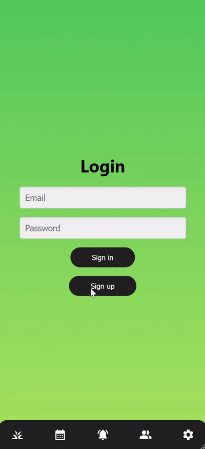

<a href="#plananaz-docs">⏫ Back to Top</a>

---

### 2.2 Login

#### 🔍 Overview
- To get started visit: [plananaz](https://plananaz.pm4.init-lab.ch/) 
- Enter the following information 
- Click on `Sign in`

| Field       | Description                  |
|-------------|------------------------------|
| Email       | User’s email address         |
| Password    | Minimum 8 characters   Minimum one uppercase letter   Minimum one number   Minimum one special character   (!@#$%^&*)  |

#### 🛠️ Step-by-Step Guide

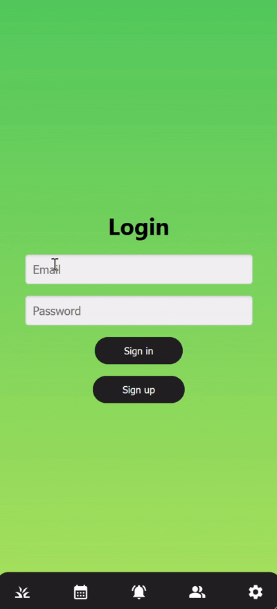

<a href="#plananaz-docs">⏫ Back to Top</a>

---

## 3. Navigation

This section describes the main navigation on the bottom of the screen.

#### 🖼️ Layout

The navigation bar is present on each page. It can be used to switch between different pages.

#### 🛠️ Step-by-Step Guide

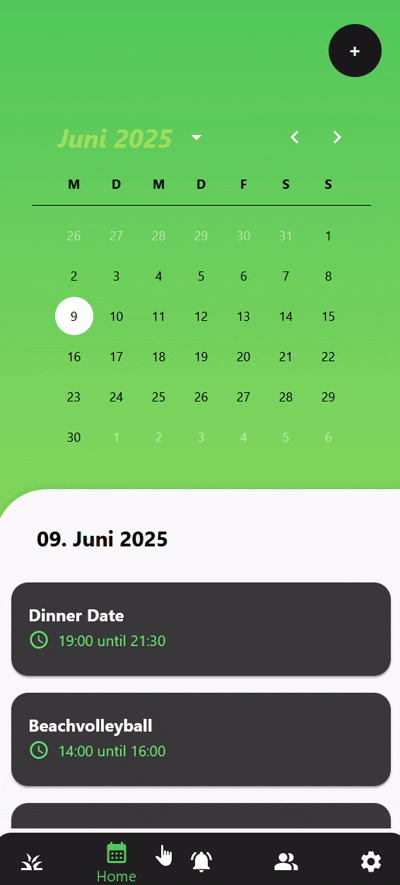

<a href="#plananaz-docs">⏫ Back to Top</a>

---

## 4. Event Overview Page

This section describes the event overview page, which is the home view.

---

#### 🖼️ Layout

The event page has the following layout:

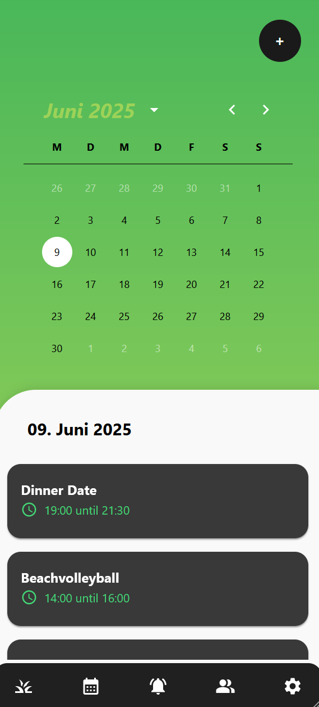

On the top right side there is the Add Event button.

Below there is the calendar. The current date is automatically selected. But with a simple click on any date it can be selected as well.

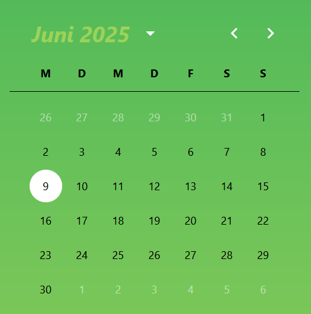

In the event section the selected date is shown again. Down below there is a list with all events that take place on this day. Those events can be opened by clicking on them.

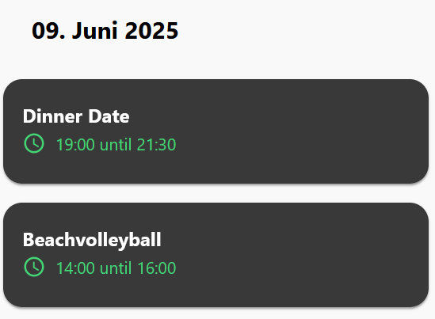

If an event is clicked, the detail view opens. It contains all the information as well as an edit and close button.

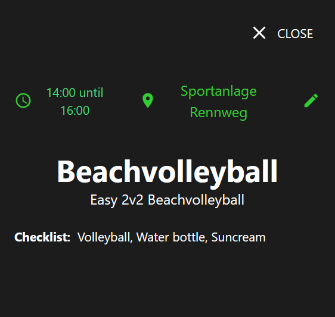

<a href="#plananaz-docs">⏫ Back to Top</a>

---

### 4.1 Create Event

#### 🔍 Overview
Click on the `Create Event` button. 
Fill in fields with information. 
Click on the `Create` button.

#### 📝 Fields & Options
- **Title** (text)  
- **Start and End Date/Time** (picker)  
- **Location** (text)  
- **Description** (long text)  
- **Checklist** (text)  
- **Number of participants** (number)  

#### 🛠️ Step-by-Step Guide

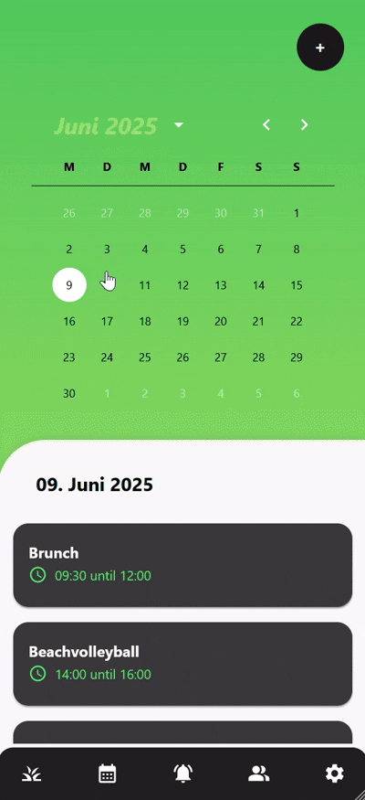

<a href="#plananaz-docs">⏫ Back to Top</a>

---

## 4.2 Edit Event

#### 🔍 Overview
- Click on the event. 
- Click on the `Edit Event` button. 
- Update fields as needed. 
- Click on the `Update` button.

#### 🛠️ Step-by-Step Guide

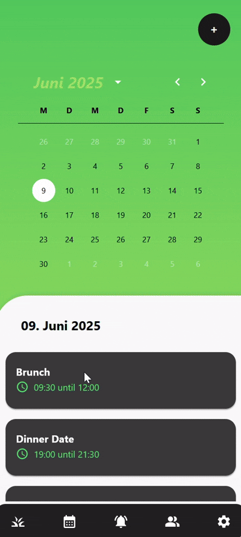

<a href="#plananaz-docs">⏫ Back to Top</a>

---

## 5. Friends Page

#### 🖼️ Layout

The Friends page has the following layout:

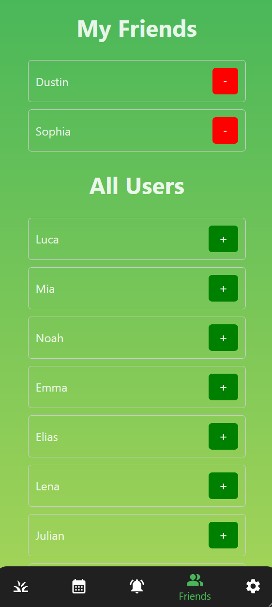

On the top there is the friends list.

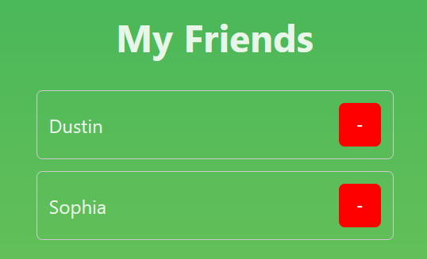

Below there is a list of all users.

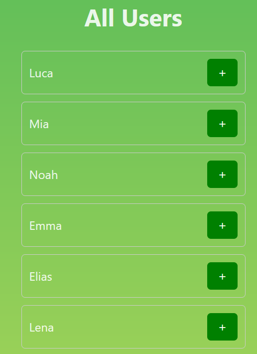

#### 🛠️ Step-by-Step Guide

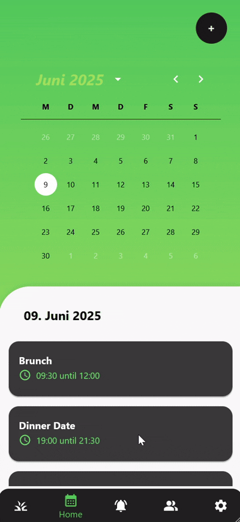

---

### 5.1 Add Friend

#### 🔍 Overview
- Click on the green `+` button to add a user as a friend.

#### 🛠️ Step-by-Step Guide

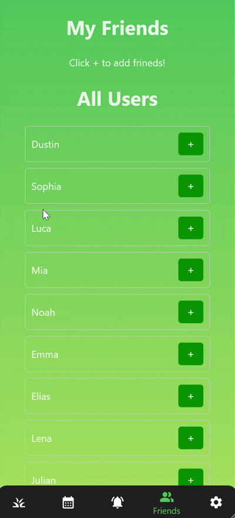

<a href="#plananaz-docs">⏫ Back to Top</a>

---

### 5.2 Remove Friend

#### 🔍 Overview
- Click on the green `-` button to delete a friend from the friends list.

#### 🛠️ Step-by-Step Guide

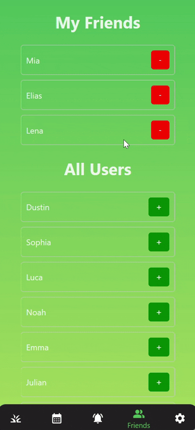

<a href="#plananaz-docs">⏫ Back to Top</a>

---

## 6. Settings Page

#### 🖼️ Layout

The Settings page contains the `Log Out` button.

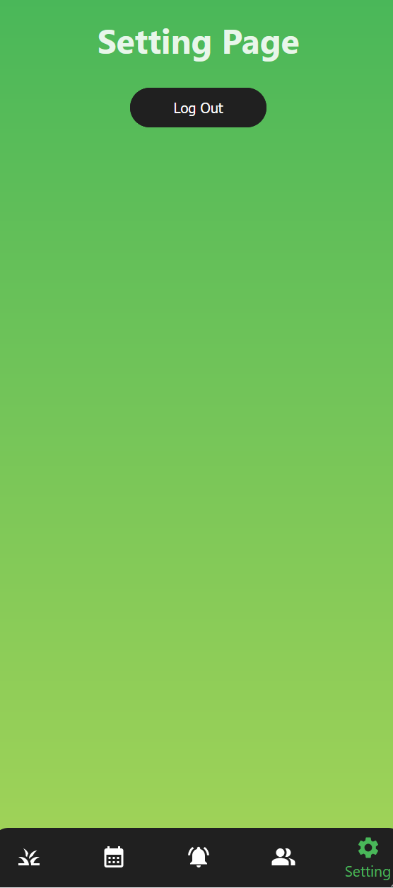

---

### 6.1 Logout

#### 🔍 Overview
- Click on the green `Log Out` button to log out. You return to the login screen afterwards.

#### 🛠️ Step-by-Step Guide

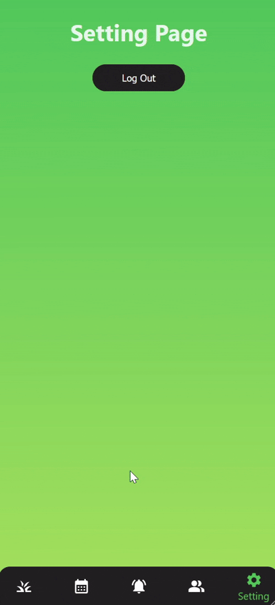

<a href="#plananaz-docs">⏫ Back to Top</a>

---
