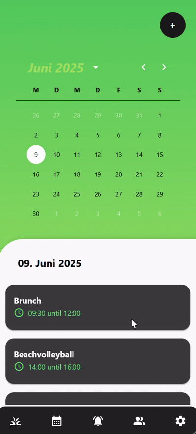

<!-- ===================== -->
<!-- Plananaz User Manual -->
<!-- ===================== -->

# Plananaz Docs
## Why Plananaz?
> **Plananaz** is a web application designed to streamline event planning and coordination for friends, family, and small teams. By bringing together user authentication, event management, and social features into one intuitive interface, Plananaz helps you organize gatherings faster and keep everyone in sync.

---

## 📑 Table of Contents

1. [Introduction](#introduction)  
2. [Signup Page](#signup-page)  
3. [Login Page](#login-page)  
4. [Event Overview Page](#event-overview-page)  
5. [Create Event](#create-event)  
6. [Edit Event](#edit-event)  
7. [Friends Page](#friends-page)  
   - [Add Friend](#add-friend)  
   - [Remove Friend](#remove-friend)  
8. [Settings Page](#settings-page)  
9. [Logout](#logout)  

---
## Introduction

### 🎯 Purpose
This documentation is intended for non-technical users who want to learn how to use the core features of Plananaz. Here you will find step-by-step guidance on:

- Registering a new account  
- Logging in and out securely  
- Creating and editing events  
- Managing your friends list (adding and removing friends)  

Each section contains clear instructions, screenshots or GIF's. Use the [⏫ Back to Top](#plananaz-user-manual) links to help you navigate effortlessly.

### 🚀 Key Features
> **Note:** This application is still under construction. More featrues will be added as they are published.

- **User Registration**  
  Create a new Plananaz account with your email and a secure password.

- **User Login & Logout**  
  Log in to access your dashboard and log out when you’re done.

- **Event Management**  
  - **Create Event**: Define event title, date, time, and description.  
  - **Edit Event**: Update event details at any time.  

- **Friend Management**  
  - **Add Friend**: Invite users by email or username.  
  - **Remove Friend**: Remove contacts you no longer wish to keep.

> **Note:** Insert a high-level GIF or screenshot of the dashboard  
> ``

[⏫ Back to Top](#plananaz-user-manual)
---

## Signup Page

### 🔍 Overview
To get started visit: [plananaz](https://plananaz.pm4.init-lab.ch/) 
Click on ``Sign up`` 
Enter the following information 
Click on ``Sign up`` again

| Field       | Description                  | Required |
|-------------|------------------------------|:--------:|
| Email       | User’s email address         | ✔️       |
| Username    | Display name within Plananaz | ✔️       |
| Password    | Minimum 8 characters   Minimum one uppercase letter   Minimum one number   Minimum one special character   (!@#$%^&*)         | ✔️       |

### 🛠️ Step-by-Step

[⏫ Back to Top](#plananaz-user-manual)
---

## Login Page

### 🔍 Overview
To get started visit: [plananaz](https://plananaz.pm4.init-lab.ch/) 
Enter the following information
Click on ``Sign in``

| Field       | Description                  | Required |
|-------------|------------------------------|:--------:|
| Email       | User’s email address         | ✔️       |
| Password    | Minimum 8 characters   Minimum one uppercase letter   Minimum one number   Minimum one special character   (!@#$%^&*)  | ✔️       |

### 🛠️ Step-by-Step

[⏫ Back to Top](#plananaz-user-manual)
---

## Event Overview Page

### 🔎 Purpose
Shows all upcoming and past events in one place.

### 🖼️ Layout
- **Calendar widget**  
- **Event cards** with title, date, location  

### ⚙️ Actions
- View details (`View` button)  
- Quick-edit (`✏️` icon)  
- Delete (`🗑️` icon)  

### 🛠️ Step-by-Step

---

## Create Event

### 🔍 Overview
Guide to adding a new event.

### 📝 Fields & Options
- **Title** (text)  
- **Date & Time** (picker)  
- **Location** (autocomplete)  
- **Description** (rich text)  
- **Invitees** (select friends)  

### 🛠️ Steps
1. Click **Create Event**.  
2. Fill in fields.  
3. Invite friends.  
4. Click **Save**.  
5. TODO: Explain optional booking integrations.

### 🛠️ Step-by-Step

---

## Edit Event

### 🔍 Overview
Modify an existing event’s details.

### 🛠️ Steps
1. On Event Overview, click **✏️ Edit**.  
2. Update fields as needed.  
3. Click **Save Changes**.  

### 🛠️ Step-by-Step

[⏫ Back to Top](#plananaz-user-manual)
---

## Friends Page

### 🔎 Purpose
Manage your social circle within Plananaz.

### 🛠️ Step-by-Step

---

### Add Friend

#### 🛠️ Steps
1. Go to **Friends**.  
2. Click **Add Friend**.  
3. Enter friend’s email or username.  
4. Click **Send Request**.  

### 🛠️ Step-by-Step

---

### Remove Friend

#### 🛠️ Steps
1. On **Friends**, find the friend.  
2. Click **Remove** (🗑️).  
3. Confirm removal.  

### 🛠️ Step-by-Step

---

## Settings Page

### 🔧 Options
- **Profile**: name, avatar  
- **Notifications**: email/push settings  
- **Integrations**: calendar, booking APIs  
- **Privacy**: data sharing preferences  

> TODO: Insert screenshots of each settings tab.

---

## Logout

### 🛠️ Steps
1. Click your **avatar** in top-right.  
2. Select **Logout**.  
3. You will be redirected to the **Login** page.

### 🛠️ Step-by-Step

---